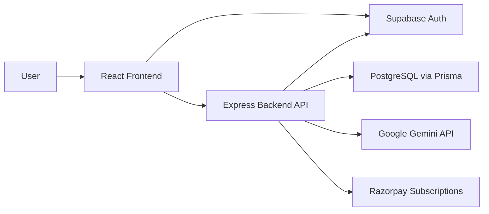
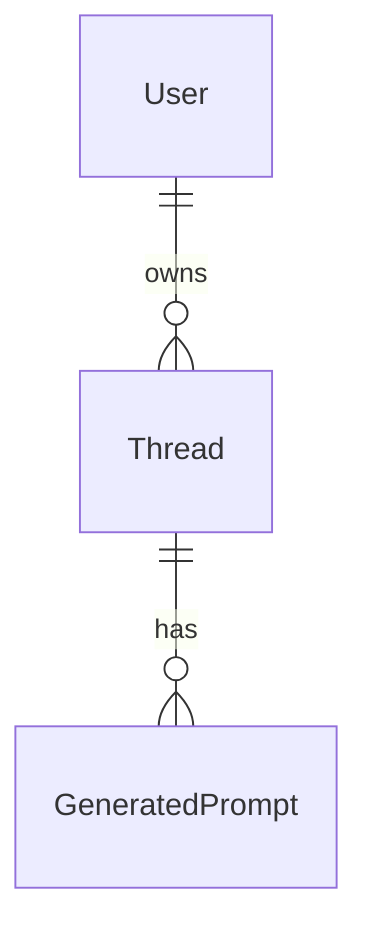

# AIFlow / ThreadBridge2 Interview Documentation

## 1. Project Overview

**AIFlow** is a full-stack SaaS application for transferring AI conversation context between different AI models.

The core problem it solves is this: users often start work in one AI model, then want to continue the same conversation in another model without losing context. AIFlow lets users import an existing conversation, analyzes it, stores the structured state, and generates optimized continuation prompts for multiple AI models.

Supported handoff targets:

- ChatGPT
- Claude
- Gemini
- DeepSeek
- Grok

The repository is organized as a full-stack monorepo with separate frontend and backend applications.

```text
ThreadBridge2/
  frontend/   React + Vite client application
  backend/    Express + Prisma API server
```

## 2. High-Level Architecture



Main flow:

1. User signs up or logs in through Supabase Auth.
2. Frontend stores the Supabase session.
3. Frontend sends API requests to the backend with a bearer token.
4. Backend validates the token with Supabase.
5. Backend reads, writes, and queries app data through Prisma.
6. Backend sends imported conversation text to Gemini for analysis.
7. Backend stores generated AI Flows and model-specific prompts.
8. Paid plans are handled through Razorpay subscriptions.

## 3. Complete Tech Stack

### Frontend

| Area | Technology |
| --- | --- |
| Framework | React 19 |
| Language | TypeScript |
| Build Tool | Vite |
| Styling | Tailwind CSS v4 |
| Routing | React Router v7 |
| Auth Client | Supabase JS |
| Icons | Lucide React |
| Animation | Framer Motion |
| UI Pattern | Local shadcn-style primitives |
| Notifications | Custom toast system |
| Deployment | Vercel |

Key frontend files:

- `frontend/src/main.tsx`: mounts the React app.
- `frontend/src/App.tsx`: defines public and protected routes.
- `frontend/src/contexts/AuthContext.tsx`: handles auth state and auth actions.
- `frontend/src/lib/api.ts`: central API client.
- `frontend/src/lib/supabase.ts`: Supabase browser client configuration.
- `frontend/src/index.css`: Tailwind theme, global styles, light/dark tokens.

### Backend

| Area | Technology |
| --- | --- |
| Runtime | Node.js 20+ |
| Framework | Express 5 |
| Language | TypeScript |
| ORM | Prisma 7 |
| Database | PostgreSQL |
| Auth Validation | Supabase Auth |
| AI Provider | Google Gemini API |
| Billing | Razorpay |
| Validation | Zod |
| File Upload | Multer |
| HTML Parsing | Cheerio |
| Security | Helmet, CORS, rate limiting |
| Logging | Morgan |
| Deployment | Railway |

Key backend files:

- `backend/src/index.ts`: API server entry point.
- `backend/src/config/env.ts`: environment variable configuration.
- `backend/src/middleware/auth.ts`: bearer token validation.
- `backend/src/routes/auth.ts`: signup, login, profile, logout, account deletion.
- `backend/src/routes/threads.ts`: AI Flow CRUD and prompt regeneration.
- `backend/src/routes/billing.ts`: Razorpay checkout, verification, cancellation, webhook.
- `backend/src/services/gemini.ts`: Gemini analysis and prompt generation.
- `backend/src/services/inputParser.ts`: input normalization for links, files, raw text, and manual summaries.
- `backend/prisma/schema.prisma`: database schema.

## 4. Folder Structure

```text
ThreadBridge2/
  package.json
  README.md
  railway.json

  frontend/
    package.json
    vite.config.ts
    vercel.json
    src/
      App.tsx
      main.tsx
      index.css
      contexts/
      lib/
      components/
      pages/

  backend/
    package.json
    tsconfig.json
    railway.json
    prisma/
      schema.prisma
      migrations/
    src/
      index.ts
      config/
      lib/
      middleware/
      routes/
      services/
      utils/
```

## 5. Frontend Architecture

The frontend is a Vite React single-page application.

### Providers

The app is wrapped with:

- `ThemeProvider`: manages light and dark mode.
- `AuthProvider`: manages Supabase session, profile, login, signup, OAuth, and logout.
- `BrowserRouter`: handles client-side routing.
- `ToastProvider`: renders global notifications.

### Routing

Public routes:

- `/`
- `/pricing`
- `/login`
- `/signup`
- `/forgot-password`
- `/reset-password`
- `/auth/callback`

Protected routes:

- `/app`
- `/app/onboarding`
- `/app/threads`
- `/app/threads/new`
- `/app/threads/:id`
- `/app/settings`

Protected routes are guarded by `ProtectedRoute`, which checks whether the user has a valid Supabase session.

### API Client

All backend requests go through `frontend/src/lib/api.ts`.

The API client:

- Adds JSON headers automatically.
- Adds `Authorization: Bearer <token>` when a token is passed.
- Supports `FormData` for file uploads.
- Parses backend error responses into readable error messages.

In development, the frontend calls:

```text
http://localhost:4000
```

In production, the frontend uses Vercel rewrites to call the Railway backend.

## 6. Backend Architecture

The backend is an Express API server written in TypeScript.

Main middleware:

- `helmet`: security headers
- `cors`: frontend origin allow-list
- `express-rate-limit`: global and route-specific rate limits
- `express.json`: JSON body parsing
- `express.urlencoded`: form body parsing
- `morgan`: request logging
- custom error handler

Main route groups:

- `/api/auth`
- `/api/threads`
- `/api/billing`
- `/health`
- `/api/health`

The backend uses a centralized error handler that supports:

- `AppError` for expected application errors
- `ZodError` for validation failures
- Prisma errors with sanitized messages
- generic server errors with safe production output

## 7. Authentication System

Authentication is handled by Supabase.

### Frontend Auth

The frontend uses `@supabase/supabase-js`.

Supabase is configured with:

- PKCE auth flow
- persistent session storage
- automatic token refresh
- custom storage key: `aiflow.auth`

Supported auth features:

- Email/password signup
- Email verification
- Email/password login
- Google OAuth login
- Forgot password
- Reset password
- Change password
- Logout
- Account deletion

### Backend Auth

The backend does not create custom JWTs.

Instead:

1. Frontend sends the Supabase access token as a bearer token.
2. Backend reads the token from the `Authorization` header.
3. Backend validates the token with `supabase.auth.getUser(token)`.
4. Backend upserts the user profile into the app database.
5. Backend attaches the authenticated user to `req.auth`.

This keeps identity management inside Supabase while still allowing the backend to maintain app-specific user data.

## 8. Database Design

The database uses PostgreSQL with Prisma.

### User

Stores app profile and billing state.

Important fields:

- `id`: UUID, same as Supabase user ID
- `email`
- `name`
- `avatarUrl`
- `plan`
- `paymentCustomerId`
- `paymentSubscriptionId`
- `subscriptionStatus`
- `subscriptionCurrentPeriodEnd`
- `promptRegenerationsThisMonth`
- `promptRegenerationMonth`
- timestamps

### Thread

Represents one saved AI Flow.

Important fields:

- `id`
- `userId`
- `title`
- `goal`
- `context`
- `keyDecisions`
- `lastPoint`
- `nextStep`
- `tags`
- `rawInput`
- `inputMethod`
- timestamps

### GeneratedPrompt

Stores one generated continuation prompt per target model.

Important fields:

- `id`
- `threadId`
- `modelName`
- `promptText`
- `createdAt`

There is a unique constraint on:

```text
threadId + modelName
```

This ensures each Flow has only one prompt per model.

### Relationships



## 9. AI Flow Creation Process

AI Flow creation is the core product workflow.

Endpoint:

```text
POST /api/threads/create
```

Flow:

1. User chooses an input method.
2. Frontend sends the input to the backend.
3. Backend validates the request using Zod.
4. Backend checks monthly usage limits.
5. Backend normalizes the conversation input.
6. Backend sends the normalized text to Gemini.
7. Gemini returns structured analysis.
8. Backend stores the Flow and generated prompts.
9. Frontend redirects to the Flow detail page.

### Supported Input Methods

#### Share Link

Supports public AI conversation share links across providers.

The backend:

- validates the URL
- allows public HTTP/HTTPS links
- checks DNS to avoid private/reserved IP targets
- validates each redirect before following it
- fetches the page
- extracts visible text or embedded conversation data
- rejects unreadable placeholder pages

#### File Upload

Supports:

- `.txt`
- `.json`

File upload is handled through Multer memory storage.

Maximum file size:

```text
1.5 MB
```

Conversation character limit:

```text
200,000 characters
```

#### Raw Text

User pastes the conversation directly.

The backend trims and normalizes whitespace before analysis.

#### Manual Description

User manually fills:

- current objective
- decisions made
- where it stopped
- what to continue

The backend converts this into a structured conversation-like text block.

## 10. Gemini Integration

Gemini integration lives in:

```text
backend/src/services/gemini.ts
```

Default model:

```text
gemini-2.5-flash
```

Gemini is asked to return JSON with:

- `title`
- `goal`
- `context`
- `key_decisions`
- `last_point`
- `next_step`
- `tags`
- `prompts`

The `prompts` object contains model-specific continuation prompts for:

- ChatGPT
- Claude
- Gemini
- DeepSeek
- Grok

The backend also includes a fallback generator. If `GEMINI_API_KEY` is missing or Gemini fails, the app still creates a usable Flow using deterministic local prompt generation.

This is useful for:

- local development
- demo reliability
- graceful degradation

## 11. Usage Limits

Monthly Flow creation limits:

| Plan | Monthly Flow Limit |
| --- | --- |
| Free | 5 |
| Starter | 20 |
| Pro | Unlimited |
| Team | Unlimited |

Monthly prompt regeneration limits:

| Plan | Monthly Regeneration Limit |
| --- | --- |
| Free | 15 |
| Starter | 60 |
| Pro | Unlimited |
| Team | Unlimited |

Limits are enforced in the backend, not only in the UI.

## 12. Billing System

Billing uses Razorpay recurring subscriptions.

Frontend:

- Pricing page loads Razorpay Checkout script.
- User selects a paid plan.
- Frontend calls backend checkout route.
- Razorpay modal opens.
- Successful payment response is sent back to backend for verification.

Backend:

- Creates Razorpay subscription
- Verifies Razorpay payment signature
- Fetches subscription from Razorpay
- Updates user plan and subscription status
- Handles cancellation
- Handles Razorpay webhooks

Billing endpoints:

```text
POST /api/billing/checkout
POST /api/billing/verify
POST /api/billing/cancel
POST /api/billing/webhook
```

Plans:

- Starter
- Pro
- Team

Razorpay signature verification uses HMAC SHA-256 and timing-safe comparison.

## 13. API Routes

### Auth Routes

```text
POST   /api/auth/signup
POST   /api/auth/login
POST   /api/auth/logout
GET    /api/auth/me
PATCH  /api/auth/me
DELETE /api/auth/me
```

### Thread Routes

```text
POST   /api/threads/create
GET    /api/threads
GET    /api/threads/:id
PATCH  /api/threads/:id
DELETE /api/threads/:id
POST   /api/threads/:id/regenerate
```

### Billing Routes

```text
POST /api/billing/checkout
POST /api/billing/verify
POST /api/billing/cancel
POST /api/billing/webhook
```

### Health Routes

```text
GET /health
GET /api/health
```

In development, the health route returns diagnostic config booleans. In production, it returns a minimal safe payload.

## 14. Security Considerations

Security practices used in the project:

- Supabase-managed authentication
- Bearer token validation on backend routes
- Protected backend routes with `requireAuth`
- Server-side plan limit enforcement
- Rate limiting on global requests
- Extra rate limits on Flow creation and regeneration
- Helmet security headers
- CORS restricted to configured frontend URL
- Zod request validation
- File size limit for uploads
- Public HTTP/HTTPS validation for share links
- DNS private IP protection for share links
- redirect validation for share links
- Razorpay signature verification
- Sanitized error messages for secrets and database URLs
- Production error responses hide internal details

## 15. Environment Variables

### Backend

```text
DATABASE_URL
DIRECT_URL
GEMINI_API_KEY
GEMINI_MODEL
SUPABASE_URL
SUPABASE_ANON_KEY
SUPABASE_SERVICE_ROLE_KEY
FRONTEND_URL
RAZORPAY_KEY_ID
RAZORPAY_KEY_SECRET
RAZORPAY_WEBHOOK_SECRET
RAZORPAY_STARTER_PLAN_ID
RAZORPAY_PRO_PLAN_ID
RAZORPAY_TEAM_PLAN_ID
```

### Frontend

```text
VITE_API_URL
VITE_SUPABASE_URL
VITE_SUPABASE_ANON_KEY
VITE_AUTH_REDIRECT_URL
```

No secrets should be committed to the repository.

## 16. Deployment

### Frontend Deployment

Target platform:

```text
Vercel
```

Frontend root directory:

```text
frontend
```

Build command:

```text
npm run build
```

Vercel rewrites:

- `/api/health` -> Railway backend health route
- `/api/:path*` -> Railway backend API
- all other routes -> Vite SPA entry

### Backend Deployment

Target platform:

```text
Railway
```

Backend root directory:

```text
backend
```

Start command:

```text
npm run start
```

Healthcheck path:

```text
/health
```

Backend build:

```text
prisma generate && tsc
```

## 17. Local Development

### Install Dependencies

Backend:

```bash
cd backend
npm install
```

Frontend:

```bash
cd frontend
npm install
```

### Prepare Database

```bash
cd backend
npm run prisma:generate
npm run prisma:dev
```

### Start Backend

```bash
cd backend
npm run dev
```

Backend runs on:

```text
http://localhost:4000
```

### Start Frontend

```bash
cd frontend
npm run dev
```

Frontend runs on:

```text
http://localhost:5173
```

## 18. Important NPM Scripts

Root scripts:

```bash
npm run dev
npm run dev:backend
npm run dev:frontend
npm run build
npm run build:backend
npm run build:frontend
npm run prisma:generate
```

Backend scripts:

```bash
npm run dev
npm run build
npm run start
npm run prisma:generate
npm run prisma:migrate
npm run prisma:dev
npm run lint
```

Frontend scripts:

```bash
npm run dev
npm run build
npm run lint
npm run preview
```

## 19. How to Explain the Project in an Interview

Short version:

> AIFlow is a full-stack SaaS app that helps users move AI conversations between models. Users import a conversation through a share link, file upload, raw text, or manual summary. The backend normalizes the input, sends it to Gemini, extracts structured context, and generates optimized prompts for ChatGPT, Claude, Gemini, DeepSeek, and Grok. Authentication is handled with Supabase, app data is stored in PostgreSQL through Prisma, and subscriptions are handled with Razorpay.

Technical version:

> The frontend is a React 19 and Vite TypeScript SPA styled with Tailwind CSS. It uses Supabase JS for authentication and React Router for protected app routes. The backend is an Express 5 TypeScript API using Prisma with PostgreSQL. Supabase manages auth, but every protected backend request validates the Supabase access token server-side. Conversation inputs are normalized by a backend parser and analyzed through the Google Gemini API. Generated structured Flow data and model-specific prompts are stored in Postgres. Billing is implemented through Razorpay subscriptions with signature verification and webhook syncing.

## 20. Interview Talking Points

### Why Supabase Auth?

Supabase provides managed authentication, email verification, OAuth, password reset, and JWT sessions. This avoids building sensitive auth flows manually while still allowing the app to store its own profile and subscription data in Postgres.

### Why Prisma?

Prisma gives type-safe database access, migrations, schema-driven modeling, and clean relationship handling between users, flows, and generated prompts.

### Why Gemini?

Gemini is used to convert unstructured conversation history into structured state. The backend asks it for a strict JSON response so the application can store and render the analysis reliably.

### Why Express?

Express keeps the backend simple and explicit. It is enough for route-based APIs, middleware, file uploads, auth checks, and webhook handling.

### Why Vite?

Vite provides fast React development, a simple build pipeline, TypeScript support, and easy deployment to Vercel.

### Why Razorpay?

Razorpay is used for recurring subscription billing, especially suitable for Indian checkout and subscription workflows.

## 21. Challenges Solved

### Challenge: Share links are inconsistent

AI share pages can expose conversation data differently. The backend handles multiple extraction methods:

- visible page text
- embedded JSON
- React/streamed data patterns

It also rejects placeholder pages when the real conversation cannot be read.

### Challenge: AI output can be unreliable

Gemini is requested to return JSON, but the backend still normalizes and validates the shape. If Gemini fails, the backend generates fallback prompts locally.

### Challenge: Auth state can become stale

The frontend clears stale Supabase storage before OAuth and login attempts. It also uses a dedicated callback route for PKCE session exchange.

### Challenge: Billing must be trusted server-side

The frontend never directly upgrades the user plan. The backend verifies Razorpay signatures and fetches the subscription before updating the database.

### Challenge: Plan limits must not be bypassed

Usage limits are enforced in backend routes, not only shown in the UI.

## 22. Possible Future Improvements

- Add automated unit and integration tests.
- Add end-to-end tests with Playwright.
- Add team workspace sharing logic.
- Add more AI providers for analysis.
- Add prompt quality scoring.
- Add export options for generated prompts.
- Add analytics for Flow usage and conversion.
- Add background jobs for long-running imports.
- Add retry queue for failed AI generation.
- Add richer subscription lifecycle handling.

## 23. Final Summary

AIFlow is a production-oriented full-stack SaaS project with:

- React frontend
- Express backend
- Supabase authentication
- PostgreSQL database
- Prisma ORM
- Gemini AI integration
- Razorpay billing
- Vercel frontend deployment
- Railway backend deployment

The most important technical strength is that the app cleanly separates responsibilities:

- Supabase handles identity.
- Express handles business logic.
- Prisma handles database access.
- Gemini handles AI analysis.
- Razorpay handles billing.
- React handles the user experience.

This makes the project understandable, scalable, and easy to explain in an interview.
